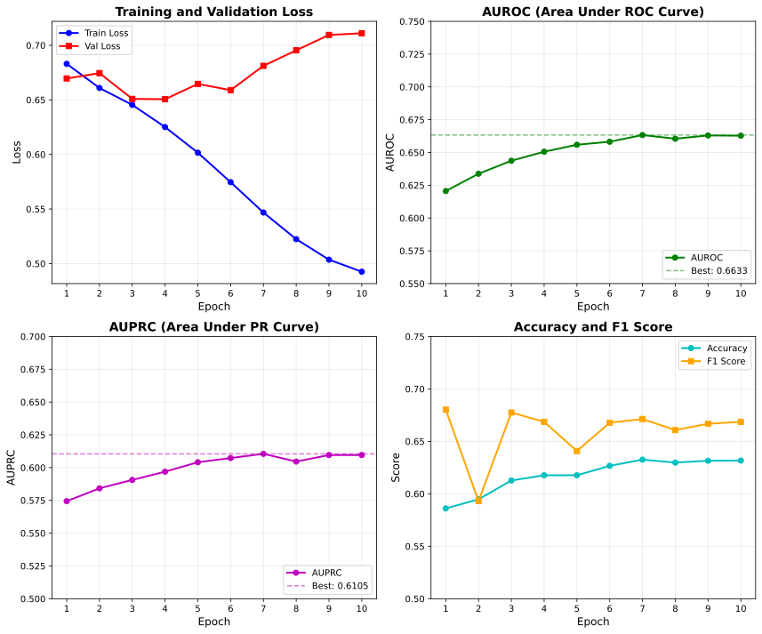

# PoultryCaduceus

A DNA foundation model for poultry genomics, based on the [Caduceus](https://github.com/kuleshov-group/caduceus) architecture.

## Overview

PoultryCaduceus is a bidirectional DNA language model pre-trained on the chicken genome (GRCg6a), designed for various downstream genomic prediction tasks including:

- **eQTL prediction** - Expression quantitative trait loci
- **sQTL prediction** - Splicing quantitative trait loci  
- **exQTL prediction** - Exon expression QTL
- **lncQTL prediction** - Long non-coding RNA QTL
- **3'aQTL prediction** - 3' alternative polyadenylation QTL
- **GWAS variant effect prediction**

## Model Architecture

| Parameter | Value |
|-----------|-------|
| Hidden dimension | 256 |
| Number of layers | 16 |
| Vocabulary size | 12 (Caduceus encoding) |
| Sequence length | 10,240 bp |
| Bidirectional | Yes |
| RC equivariant | Yes |
| Total parameters | ~7.8M |

## Quick Start

### Installation

```bash
# Clone the repository
git clone https://github.com/chengzhimin/PoultryCaduceus.git
cd PoultryCaduceus

# Create conda environment
conda env create -f environment.yml
conda activate poultry_caduceus

# Or install dependencies manually
pip install torch transformers mamba-ssm causal-conv1d h5py pyfaidx scikit-learn tqdm pyyaml
```

### Data Preparation

1. **Download the chicken genome (GRCg6a)**:
```bash
mkdir -p data/genome
wget -O data/genome/Gallus_gallus.GRCg6a.dna.toplevel.fa.gz \
    https://ftp.ensembl.org/pub/release-104/fasta/gallus_gallus/dna/Gallus_gallus.GRCg6a.dna.toplevel.fa.gz
gunzip data/genome/Gallus_gallus.GRCg6a.dna.toplevel.fa.gz
```

2. **Download ChickenGTEx QTL data** from [Zenodo](https://zenodo.org/records/14902956):
```bash
mkdir -p data/raw/{eqtl,sqtl,exqtl,lncqtl,3aqtl}
# Place downloaded files in corresponding directories
```

3. **Process QTL data**:
```bash
# Process all QTL types
python scripts/process_all_qtl_h100.py --all

# Or process individual task
python scripts/process_all_qtl_h100.py --task eqtl --seq_length 10240
```

### Fine-tuning

```bash
# Fine-tune on eQTL prediction
python scripts/train_finetune.py --config configs/train_config.yaml --task eqtl

# Fine-tune on all tasks
python scripts/train_finetune.py --config configs/train_config.yaml --all
```

## eQTL Fine-tuning Results

Fine-tuning on ChickenGTEx eQTL data (50,045 training samples, 12,511 validation samples):

### Training Configuration

| Parameter | Value |
|-----------|-------|
| Batch size | 32 |
| Learning rate | 5e-5 |
| Epochs | 10 |
| Sequence length | 10,240 bp |
| Mixed precision | bf16 |
| Optimizer | AdamW |

### Performance Metrics

| Epoch | Train Loss | Val Loss | AUROC | AUPRC | Accuracy | F1 |
|-------|------------|----------|-------|-------|----------|-----|
| 1 | 0.6830 | 0.6696 | 0.6206 | 0.5744 | 0.5861 | 0.6803 |
| 2 | 0.6609 | 0.6745 | 0.6338 | 0.5842 | 0.5948 | 0.5931 |
| 3 | 0.6454 | 0.6509 | 0.6437 | 0.5906 | 0.6127 | 0.6775 |
| 4 | 0.6251 | 0.6506 | 0.6506 | 0.5969 | 0.6177 | 0.6686 |
| 5 | 0.6016 | 0.6646 | 0.6559 | 0.6041 | 0.6177 | 0.6408 |
| 6 | 0.5746 | 0.6589 | 0.6582 | 0.6073 | 0.6267 | 0.6678 |
| **7** | **0.5468** | **0.6812** | **0.6633** | **0.6105** | **0.6326** | **0.6713** |
| 8 | 0.5224 | 0.6954 | 0.6605 | 0.6046 | 0.6298 | 0.6608 |
| 9 | 0.5036 | 0.7095 | 0.6630 | 0.6096 | 0.6315 | 0.6668 |
| 10 | 0.4926 | 0.7110 | 0.6628 | 0.6096 | 0.6317 | 0.6686 |

**Best Model (Epoch 7):**
- **AUROC: 0.6633**
- **AUPRC: 0.6105**
- **Accuracy: 63.26%**

### Training Curves



## Data Format

### Input HDF5 Format

```python
# HDF5 file structure
{
    'sequences': (N, seq_length) int8,  # DNA sequences
    'labels': (N,) int8,                 # Labels (1=QTL, 0=non-QTL)
}

# Attributes
{
    'seq_length': 10240,
    'encoding': 'caduceus_compatible',
    'encoding_map': 'A=7, C=8, G=9, T=10, N=5',
    'genome': 'GRCg6a'
}
```

### Sequence Encoding (Caduceus Compatible)

| Nucleotide | Code |
|------------|------|
| A | 7 |
| C | 8 |
| G | 9 |
| T | 10 |
| N | 5 |

## Project Structure

```
PoultryCaduceus/
├── configs/
│   ├── data_config.yaml      # Data processing configuration
│   └── train_config.yaml     # Training configuration
├── scripts/
│   ├── process_all_qtl_h100.py   # QTL data processing
│   └── train_finetune.py         # Fine-tuning script
├── data/
│   ├── genome/               # Chicken genome files
│   ├── raw/                  # Raw QTL data
│   │   ├── eqtl/
│   │   ├── sqtl/
│   │   ├── exqtl/
│   │   ├── lncqtl/
│   │   └── 3aqtl/
│   └── processed/            # Processed HDF5 files
├── output/                   # Training outputs
├── environment.yml           # Conda environment
└── README.md
```

## Data Sources

| Data | Source | Link |
|------|--------|------|
| Chicken Genome | Ensembl | [GRCg6a](https://ftp.ensembl.org/pub/release-104/fasta/gallus_gallus/) |
| eQTL/sQTL/exQTL/lncQTL/3'aQTL | ChickenGTEx | [Zenodo](https://zenodo.org/records/14902956) |
| GWAS | ChickenGTEx | [Website](http://chickengtex.farmgtex.org) |

